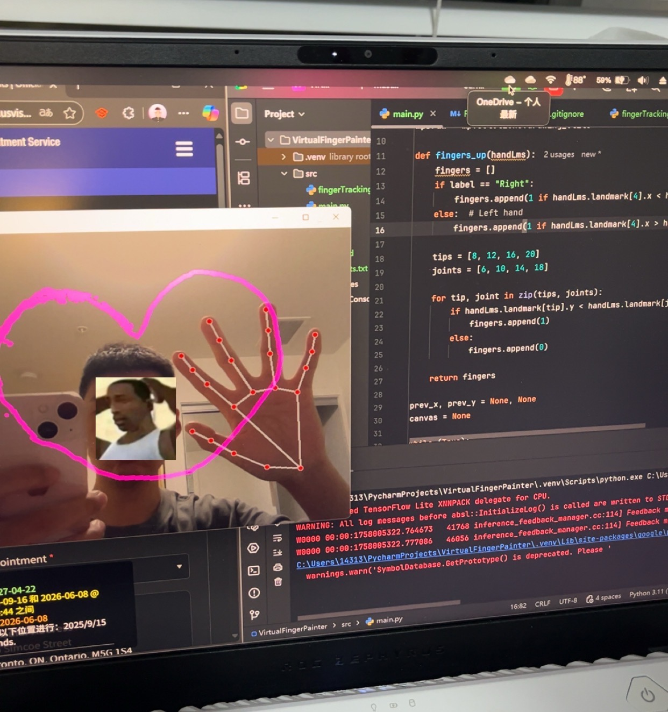

### 🖐️ Hand Drawing using OpenCV & MediaPipe

Draw in the air using your **hand gestures** — powered by **OpenCV**, **MediaPipe**, and **Python**.

This project uses your webcam to detect hand landmarks and lets you draw on the screen by lifting your **index finger**.
Use gestures to **draw**, **clear the canvas**, or **reset your stroke** — all hands-free!

---

## 📸 Demo

```


```

---

## 🧠 Features

✅ Real-time hand tracking using MediaPipe
✅ Draw lines by raising your index finger
✅ Automatically clears with specific hand gestures
✅ Works for both left and right hands
✅ Lightweight and easy to set up

---

## 🧩 Requirements

Make sure you have **Python 3.8+** installed.

Install all dependencies:

```bash
pip install -r requirements.txt
```

**requirements.txt**

```
opencv-python>=4.8.0
numpy>=1.24.0
mediapipe>=0.10.0
```

---

## 🚀 How to Run

1. **Clone the repository**

   ```bash
   git clone https://github.com/<your-username>/hand-drawing-mediapipe.git
   cd hand-drawing-mediapipe
   ```

2. **Install dependencies**

   ```bash
   pip install -r requirements.txt
   ```

3. **Run the program**

   ```bash
   python hand_draw.py
   ```

4. **Controls**

   * ✋ **Raise index finger (Right hand)** → draw
   * 🖐️ **Open all fingers (Right hand)** → stop drawing
   * 👋 **Open all fingers (Left hand)** → clear canvas
   * ❌ **Press ‘q’** → quit the program

---

## 🧠 How It Works

* The webcam feed is captured via **OpenCV** (`cv2.VideoCapture`).
* **MediaPipe Hands** detects and tracks hand landmarks in real time.
* The script checks which fingers are raised using the `fingers_up()` function.
* Based on the detected gesture:

  * If only the index finger is up → draw line on the canvas.
  * If all fingers are up (right hand) → lift pen.
  * If all fingers are up (left hand) → clear canvas.

---

## 🧱 Project Structure

```
hand-drawing-mediapipe/
│
├── main.py           # main program
├── requirements.txt       # dependencies
├── .gitignore             # ignored files
├── README.md              # project description
└── assets/                # store demo images or gifs
```

---

## 🧑‍💻 Author

**Michael Zhang**
Computer Engineering Student
📍 University of British Columbia
